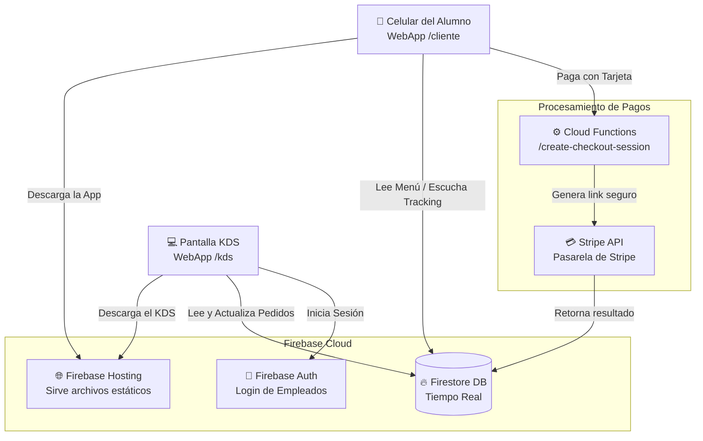

# 🚀 PlazaFlow: Documento de Arquitectura y Retrospectiva

Este documento ha sido generado para explicar de forma exhaustiva qué es PlazaFlow, cómo está construido, las decisiones tecnológicas que se tomaron y las lecciones aprendidas durante su desarrollo.

---

## 1. Descripción breve del sistema

**PlazaFlow** es un sistema digital de gestión de pedidos (Order Management System) diseñado específicamente para eliminar las filas y agilizar el proceso de compra de alimentos en la caseta o quiosco escolar. 

El sistema está dividido en dos grandes experiencias:
1. **Frontend del Cliente:** Una aplicación web móvil (optimizada para celulares) que los estudiantes abren al escanear un código QR. Aquí pueden explorar el menú, agregar productos a un carrito, pagar (en efectivo o tarjeta) y seguir el estado de su orden en tiempo real.
2. **KDS (Kitchen Display System) / Admin:** Un tablero digital Kanban utilizado por el personal de la caseta para recibir pedidos en tiempo real, gestionarlos (marcar como en preparación, listos o entregados), y administrar el inventario/stock de los productos.

---

## 2. Tecnologías y herramientas utilizadas (El Stack)

El proyecto utiliza un stack moderno y "serverless", lo que significa que no dependemos de mantener un servidor físico prendido, sino que todo se escala automáticamente en la nube.

*   **HTML, CSS (TailwindCSS/Vanilla) y JavaScript (Vanilla):**
    *   **¿Qué es?** Son los lenguajes fundamentales de la web. En este proyecto se optó por JS puro sin frameworks pesados (como React o Angular) para mantener la aplicación extremadamente ligera, asegurando que cargue rápido incluso con mala señal en el celular.
*   **Vite:**
    *   **¿Qué es?** Es una herramienta de construcción (build tool) de nueva generación para proyectos web. 
    *   **¿Por qué usarlo?** Tradicionalmente se usaba Webpack, pero Vite es infinitamente más rápido. Compila el código, recarga la página instantáneamente cuando hacemos cambios en desarrollo, y al final "comprime" y minifica todo el proyecto para que los archivos pesen lo mínimo posible al enviarlos a Firebase Hosting.
*   **Firebase (Hosting, Firestore, Auth):**
    *   **¿Qué es?** Es la plataforma de Google para desarrollo de aplicaciones sin manejar servidores (Backend as a Service). 
    *   **¿Por qué usarlo?**
        *   *Firestore:* Es una base de datos NoSQL en **tiempo real**. Esto es crítico para PlazaFlow. Cuando un cocinero marca un taco como "Listo", la pantalla del teléfono del estudiante se actualiza instantáneamente sin tener que recargar la página. Si usáramos una base de datos tradicional, tendríamos que programar WebSockets complicados.
        *   *Hosting:* Sirve la página web a nivel mundial con mucha velocidad gracias a sus CDNs.
        *   *Reglas de Seguridad:* Permiten que la base de datos sea pública para leer el menú, pero prohíben que un estudiante modifique los precios o elimine productos (verificado en el archivo `firestore.rules`).
*   **Stripe & Cloud Functions:**
    *   **¿Qué es?** Stripe es el estándar de la industria para procesar pagos con tarjeta. Cloud Functions son pequeños pedazos de código de servidor que solo se ejecutan cuando se les llama por HTTP.
    *   **¿Por qué usarlo?** Por seguridad, no podemos cobrar tarjetas directamente en el código del navegador. Usamos Stripe para redirigir a una bóveda segura, y Cloud Functions actúan como el backend intermediario para validar el pago antes de marcar el pedido como pagado.

---

## 3. Arquitectura general del sistema

A continuación se presenta un diagrama de arquitectura de cómo se comunican las piezas.

---

## 4. Lista de módulos o funciones más importantes

1.  **Módulo de Catálogo y Carrito (`src/client/app.js`):** Renderiza dinámicamente las tarjetas de los productos, filtra por categorías, maneja la adición/eliminación de ítems, calcula totales y permite elegir opciones especiales obligatorias.
2.  **Módulo de Checkout y Pagos:** Evalúa si el usuario pagará en efectivo (registrando el pedido como `pago_pendiente`) o con tarjeta (redirigiendo a Stripe mediante Cloud Functions). Valida en tiempo real que el pedido no exceda el stock actual.
3.  **OrderManager / KDS (`src/kds/orderManager.js`):** Un módulo exclusivo del personal de la caseta que se suscribe a los cambios en Firestore y acomoda las tarjetas de pedidos entrantes en un tablero Kanban: "Nuevos", "Preparando", "Listos", "Entregados".
4.  **Sistema de Tracking:** Un "listener" en el cliente que vigila en tiempo real el documento de la base de datos de un pedido específico. Si el cocinero cambia el estado a "Listo", la interfaz de usuario del estudiante muestra una celebración y le avisa que vaya a recoger su comida.
5.  **Control de Stock Seguro (`firestore.rules`):** Las reglas de la base de datos están configuradas para bloquear peticiones maliciosas, pero permiten a un cliente restar su compra del inventario general siempre y cuando la cantidad resultante nunca sea menor a 0.

---

## 5. ¿Se desarrolló App Móvil?

**No se desarrolló como una App Nativa (App Store / Play Store).** El sistema fue construido como una **WebApp Responsiva Mobile-First**. 

**¿La razón?** Eliminar la fricción de uso. Un estudiante que está en su hora de receso no tiene la paciencia para buscar, descargar, instalar y crear una cuenta en una app de 50MB solo para comprar un taco. Al escanear un código QR impreso en la plaza, el navegador de su celular abre instantáneamente la aplicación, la cual cuenta con componentes visuales amplios y navegación fluida que la hacen sentir y funcionar exactamente como una app nativa, logrando adopción inmediata.

---

## 6. Fases del Proyecto Recorridas (Evolución)

1.  **Fase 1: Descubrimiento y Diseño UX.** Se analizó el cuello de botella físico (la toma de pedidos y cobro a mano) y se diseñó una UI elegante y de alto contraste enfocada 100% en el celular del estudiante.
2.  **Fase 2: Estructuración Frontend (Vite + Vanilla).** Se maquetó todo el HTML y CSS (usando utilidades Tailwind) para validar el flujo del usuario: `Menú -> Carrito -> Checkout`.
3.  **Fase 3: Integración Backend (Firebase).** Se sustituyeron los datos estáticos conectando el frontend con Firestore, logrando que el menú fuera dinámico y manejado desde la base de datos.
4.  **Fase 4: Desarrollo del KDS (Admin).** Se programó la pantalla de cocina (`/kds`), implementando WebSockets (snapshot listeners) para recibir las órdenes al segundo sin tener que recargar la página.
5.  **Fase 5: Integración de Pagos (Stripe).** Creación del puente entre el carrito y Stripe Checkout a través de Node.js/Express, migrando después a Cloud Functions para producción.
6.  **Fase 6: Pulido, Reglas y Entrega.** Refinamiento de la validación del carrito (manejo de "agotados") y blindaje de la base de datos con reglas estrictas de seguridad.

---

## 7. Principal riesgo identificado y cómo lo mitigaron

**Riesgo:** Race Conditions y Sobreventa de Inventario.
*Escenario:* Queda exactamente 1 taco en inventario. Dos estudiantes distintos lo tienen en su carrito y presionan el botón "Pagar" exactamente en el mismo segundo.
**Mitigación:** 
*   **En el Frontend:** El carrito consulta y bloquea agregar más ítems de los permitidos por la variable `stock`. Antes de enviar a Stripe, hace una doble comprobación de disponibilidad.
*   **En la Base de Datos:** Las reglas de Firebase validan lógicamente que la operación de actualizar el inventario (`request.resource.data.stock >= 0`) jamás arroje un número negativo. El sistema rechaza automáticamente y arroja un error al estudiante que llegó milisegundos más tarde, protegiendo al negocio de vender algo que no tiene.

---

## 8. ¿Qué lograron? ¿Qué quedó pendiente y por qué?

**Logros:**
*   Se eliminó por completo la fricción de las filas; el proceso de compra es asíncrono y los alumnos recogen solo cuando su pantalla indica "Listo".
*   Sincronización de datos ultra-rápida entre cliente y cocina, sin fallos ni recargas de pantalla gracias al uso de Firebase Snapshots.
*   **Reembolsos Automáticos Integrados:** Si la cocina se ve obligada a cancelar un pedido pagado con tarjeta, se procesa la devolución de dinero de forma automatizada mediante el endpoint de Stripe y Cloud Functions, sin necesidad de hacerlo manualmente en su dashboard.
*   Una interfaz de usuario limpia, clara y "Premium" con un diseño responsivo y muy intuitivo.

**Quedó Pendiente:**
*   **Notificaciones con Pantalla Bloqueada:** Poder hacer vibrar o sonar el teléfono del alumno cuando su pedido está listo, incluso si tiene el celular bloqueado o guardado en el bolsillo. *Por qué quedó pendiente:* Los navegadores móviles congelan la ejecución de código (como la vibración nativa) al bloquear la pantalla por ahorro de batería. Resolverlo requiere integrar tecnologías más complejas como *Web Push Notifications* o servicios de SMS (Twilio) que excedían los objetivos de este primer MVP.
*   **Estadísticas y Gráficas de Ventas:** Panel visual con métricas de ganancias diarias y platos más vendidos para el dueño. *Por qué quedó pendiente:* Las bases de datos NoSQL como Firestore no hacen sumatorias dinámicas complejas de forma nativa. Crear esto requería exportar los datos o programar consultas pesadas que se des-priorizaron para asegurar primero la velocidad de compra en vivo.

---

## 9. Aprendizajes más relevantes del equipo

*   **Vanilla JS es poderoso pero riesgoso a escala:** Construir todo sin React ni Vue demostró que las webapps pueden ser extremadamente ligeras. Sin embargo, el equipo notó que mantener un archivo como `app.js` (que roza las 1,100 líneas con mucho `innerHTML`) puede volverse difícil de modificar sin romper algo accidentalmente.
*   **El impacto visual del "Real-Time":** Integrar bases de datos en tiempo real genera una confianza inmediata en el usuario. Ver que un pedido cambia de estado frente a sus ojos elimina la ansiedad clásica de "¿sí habrá llegado mi pedido?".
*   **La complejidad de sincronizar bases de datos con pagos externos:** El proceso de integrar Stripe nos enseñó que delegar el pago y esperar una respuesta asíncrona segura es mucho más laborioso que solo descontar un saldo local, pero es vital para el e-commerce.

---

## 10. Lo que harían diferente si volvieran a empezar

1.  **Adoptar un Framework Reactivo desde el inicio:** Si bien fue un gran reto usar puro JavaScript, para una V2 iniciaríamos con **React, Vue o Svelte**. Esto nos permitiría dividir el mega-archivo `app.js` en pequeños "componentes" (`<TarjetaProducto>`, `<BotonCarrito>`, etc.), haciendo el mantenimiento mil veces más sencillo.
2.  **Usar TypeScript:** Al estar manejando datos financieros (precios y cantidades), un tipado estricto con TypeScript hubiese evitado "bugs tontos" en desarrollo (como sumar `10 + "5" = 105` en vez de 15) al advertirnos que una variable era de texto y no número.
3.  **Gestión de Estado (Pinia/Redux):** El sistema actual depende bastante de guardar arrays en `localStorage` y métodos manuales de actualizar la interfaz (`actualizarUICarrito()`). Usar un manejador de estados global nos ahorraría docenas de líneas de código y evitaría que la información de la pantalla se desincronice.
